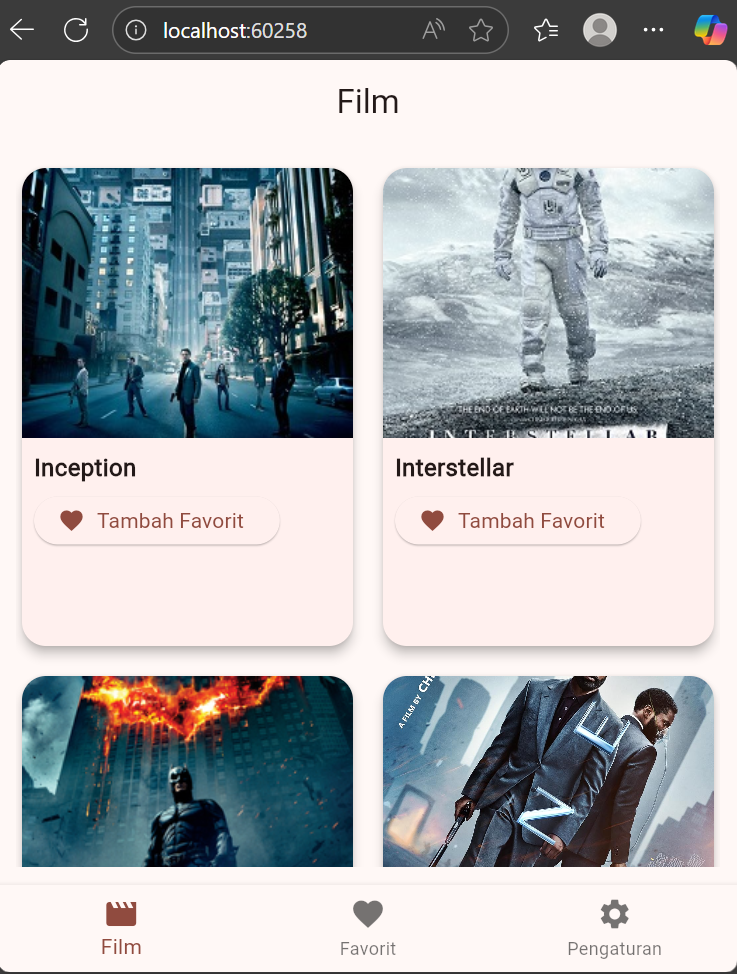
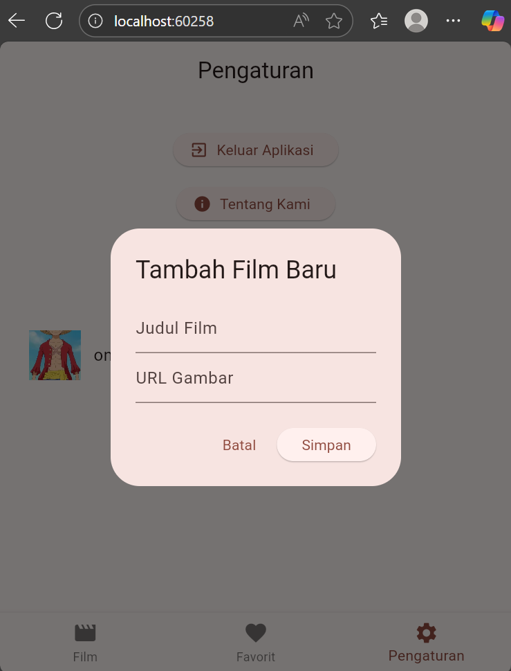

# asesmen1_pm

Asesmen 1 Pemrograman Mobile

Anggota tim:
1. Muhamad Rizki Syaban Lahay - 2310120026
2. Muhammad Adil Mubarak - 2310130008

Tema Aplikasi-> Favorite Movies App

Deskripsi Singkat:
Aplikasi dengan nama "Netplix" merupakan sebuah library film yang didalamnya terdapat beberapa daftar film. User dapat menambahkan sendiri koleksi film ke dalam library Netplix. Dan user juga dapat memilih untuk menambahkan atau menghapus film-film favoritnya.

Pembagian tugas:
Syaban = Inisiasi projek flutter, membuat repository, membuat ppt
Adil = Mengembangkan sistem CRUD film, membuat tampilan aplikasi

Screenshot:

Penjelasan singkat:
Dalam aplikasi ini terdapat dua list, yaitu library biasa dan film favorit. Dalam library biasa, user hanya dapat menambahkan film baru dan tidak bisa menghapus film yang sudah ada. Sedangkan list film favorit, user dapat memilih dari library film yang sudah ada untuk kemudian ditambahkan ke dalam daftar film favorit. Dalam list ini, user dapat menghapus film dari list film favorit.

## Getting Started

This project is a starting point for a Flutter application.

A few resources to get you started if this is your first Flutter project:

- [Lab: Write your first Flutter app](https://docs.flutter.dev/get-started/codelab)
- [Cookbook: Useful Flutter samples](https://docs.flutter.dev/cookbook)

For help getting started with Flutter development, view the
[online documentation](https://docs.flutter.dev/), which offers tutorials,
samples, guidance on mobile development, and a full API reference.
