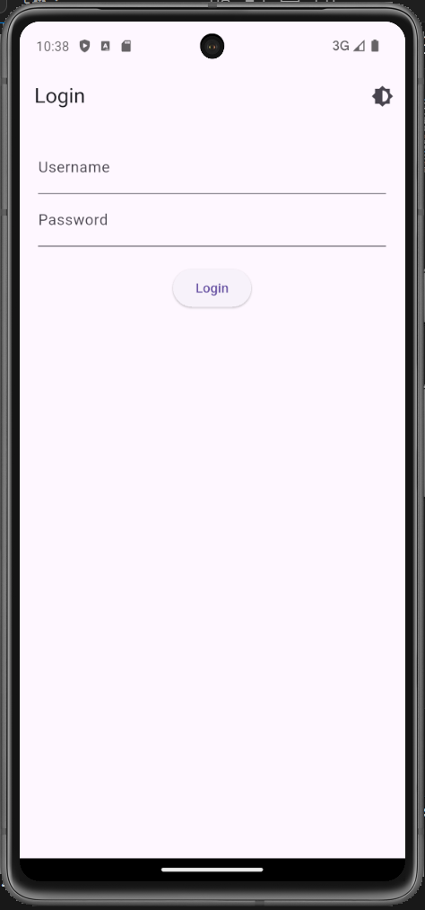
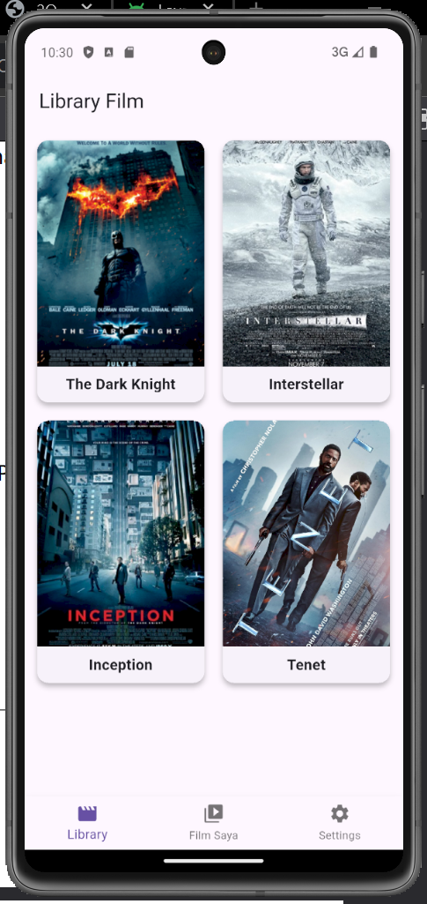
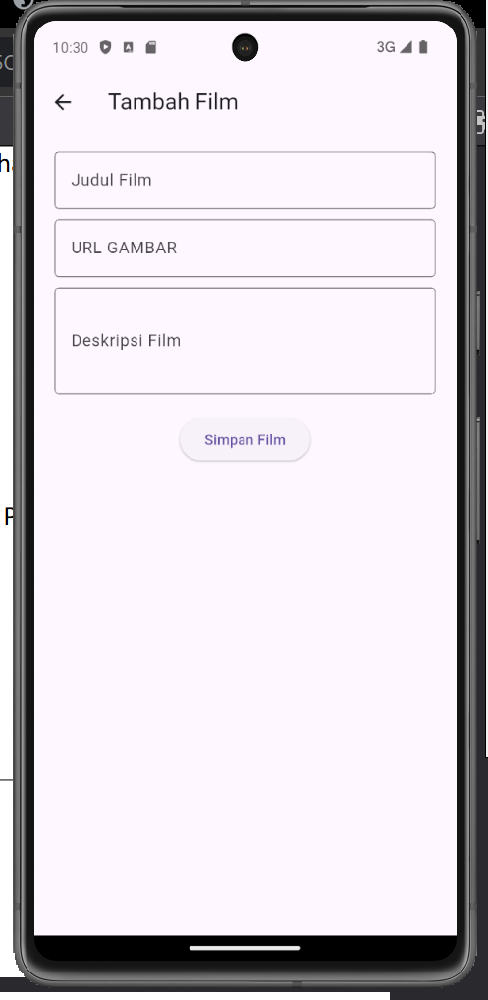
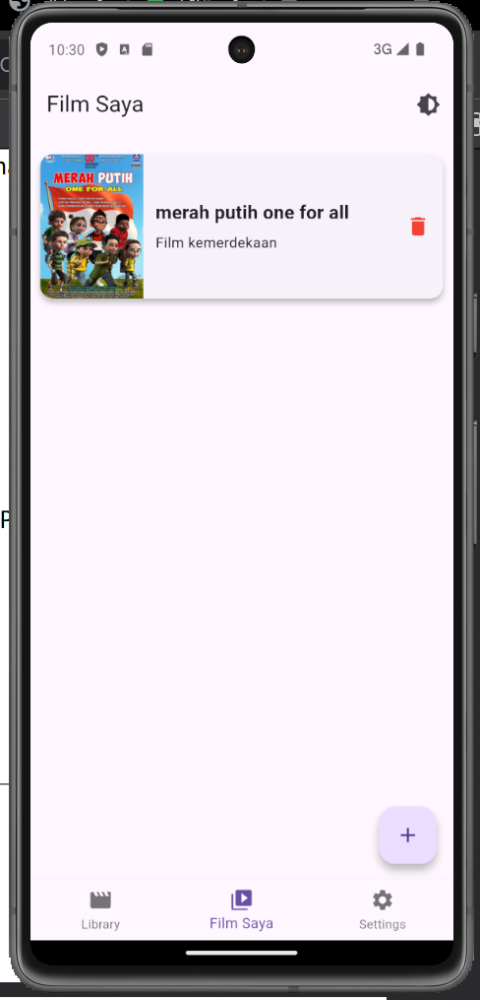
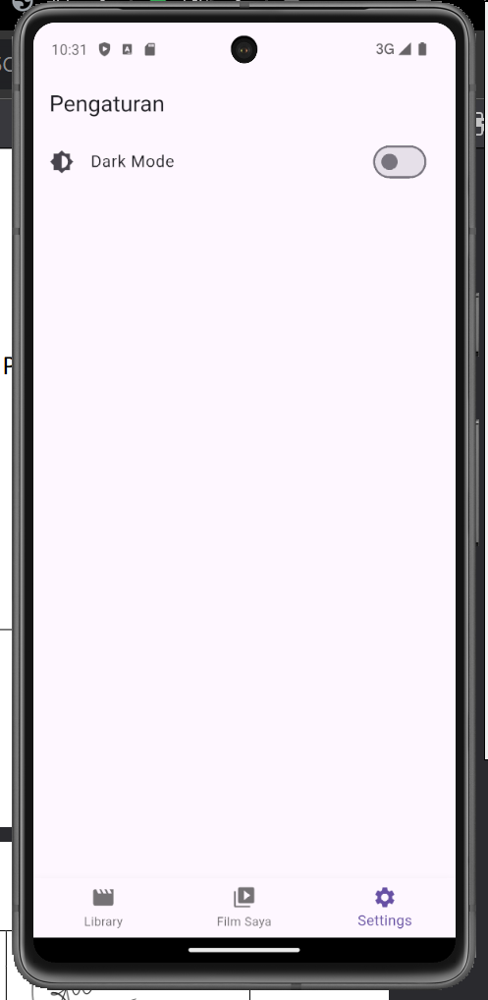
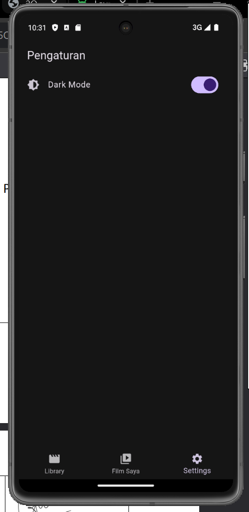
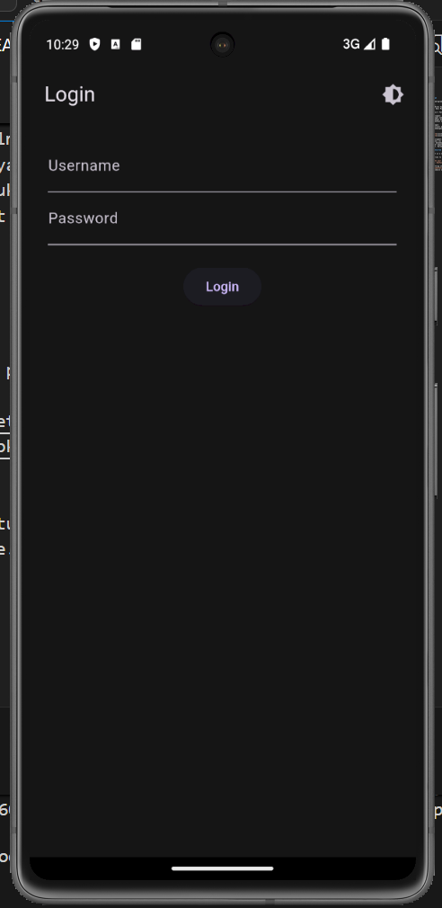
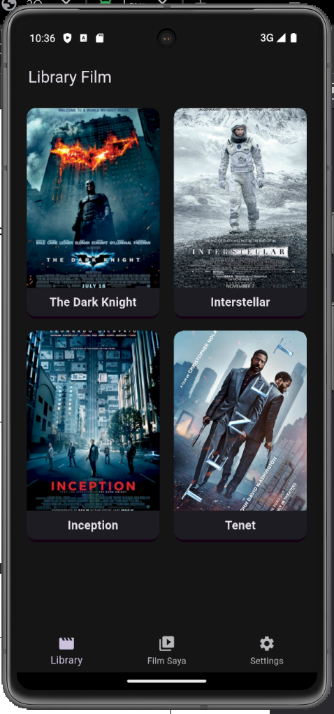
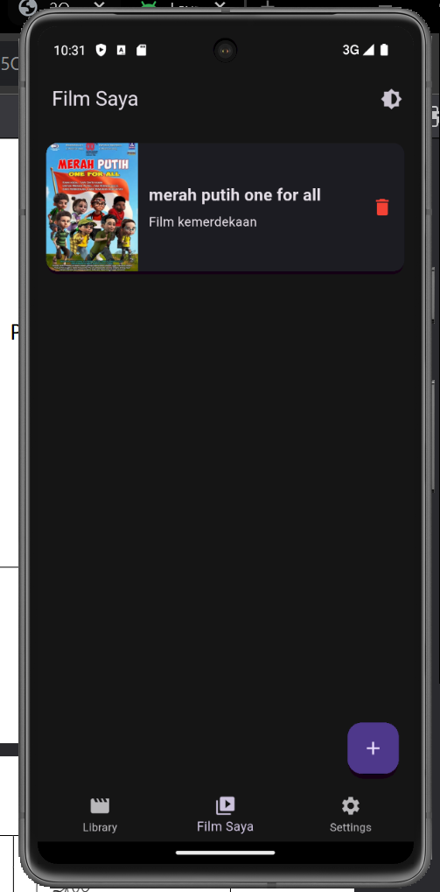

# asesmen2_pm

Asesmen 2 Pemrograman Mobile

Anggota tim:
1. Muhamad Rizki Syaban Lahay - 2310120026
2. Muhammad Adil Mubarak - 2310130008

Tema Aplikasi-> Favorite Movies App

Deskripsi Singkat:
Aplikasi dengan nama "Netplix" merupakan sebuah library film yang didalamnya terdapat beberapa daftar film. User dapat menambahkan sendiri koleksi film ke dalam library Netplix. Dan user juga dapat memilih untuk menambahkan atau menghapus film-film favoritnya.

Pembagian tugas:
Syaban = Membuat fitur: login page, CRUD SQLite, list in-memory UI
Adil = Membuat fitur: light/dark mode, simpan data dengan sharedpreferences, UI widget dasar flutter

Penjelasan singkat:
Dalam aplikasi ini, user dapat terlebih dahulu login dengan menginput username dan juga password. Kemudian untuk fitur light/dark mode nya bisa digunakan bahkan saat masih di halaman login, dan ketika sudah berhasil login, terdapat halaman sendiri khusus untuk mengubah light/dark mode nya. Kemudian untuk menyimpan data, pertama-tama user bisa melakukan CRUD untuk menambahkan film favoritnya ke dalam SQLite, yang kemudian akan ditampilkan langsung denga list in-memory UI. Lalu karena menggunakan sharedpreferences, meskipun user sudah menutup aplikasi, ketika user login lagi, maka list film yang sudah ditambahkan, bahkan setting light/dark mode nya masih tersimpan dan mengikuti terkakhir yang dibuat oleh user.

Screenshot:

